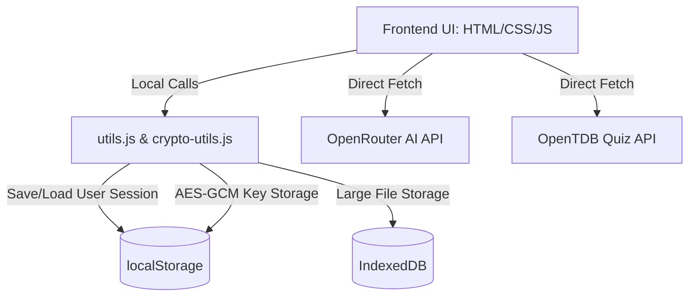
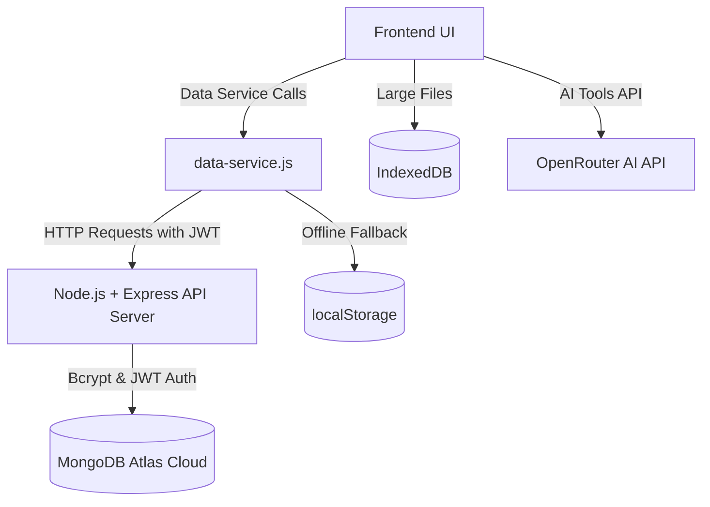
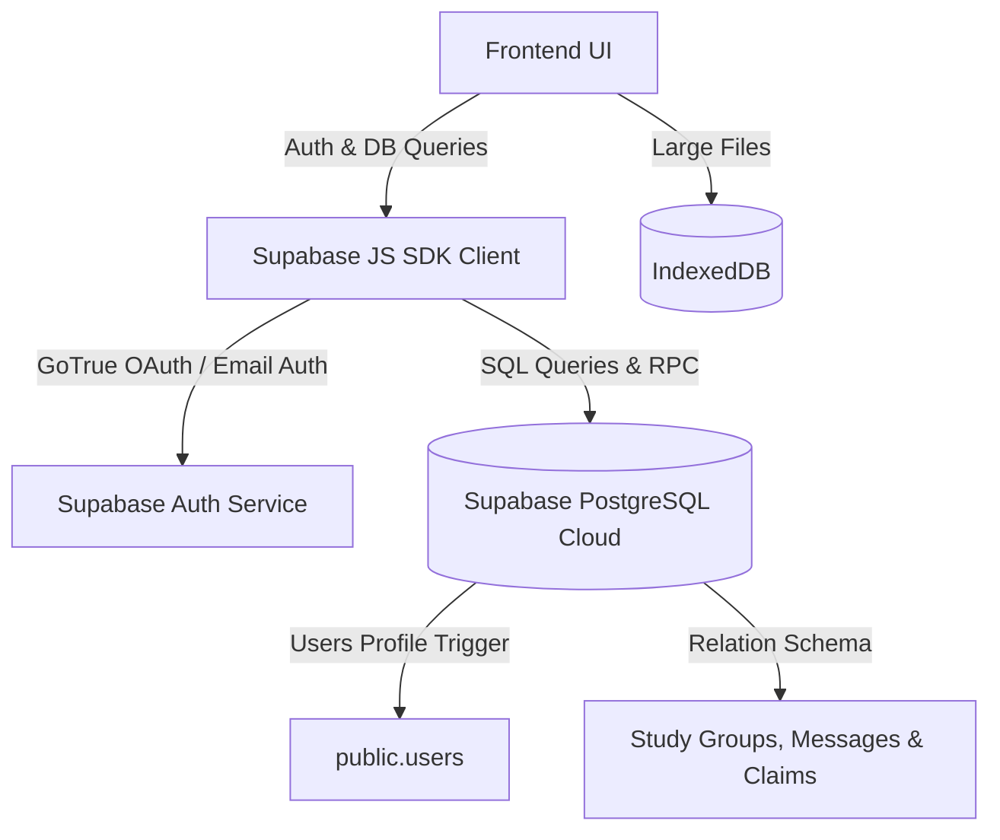

# 🤖 Smart Service Campus Bot

[](https://opensource.org/licenses/MIT)
[](https://html.spec.whatwg.org/)
[](https://www.w3.org/Style/CSS/)
[](https://developer.mozilla.org/en-US/docs/Web/JavaScript)
[](https://nodejs.org/)
[](https://www.mongodb.com/)
[](https://supabase.com/)

A comprehensive, enterprise-grade, multi-page web application designed to transform campus services through a futuristic, **Jarvis-inspired immersive interface**. 

Developed with a modular architecture, the system provides students and administrators with a secure, centralized hub for managing everyday campus activities. To showcase different development patterns, the workspace contains **three distinct architectural versions** ranging from pure client-side serverless to cloud database integration.

---

## 👨‍💻 Developer Information

* **Developer:** **Pondara Akhil Behara**
* **Academic Level:** B.Tech 3rd Year Student
* **Department:** Artificial Intelligence & Data Science (AI & DS)
* **Institution:** Chaitanya Engineering College, Kommadi, Visakhapatnam

---

## 📂 Workspace Directory Structure

The project is structured into three distinct folders, each representing a unique backend and data persistence philosophy:

```
thinkering-project/
├── 📁 thinkring-project-without-db-integration/    # Pure client-side, local-only version
│   └── 📁 smart-campus-bot/                        # Frontend UI utilizing local storage & Web APIs
│
├── 📁 thinkring-project-with-mango-db-integration/ # REST API version with Node.js + Express
│   ├── 📁 smart-campus-bot/                        # Frontend UI utilizing MongoDB Data Service
│   └── 📁 backend/                                 # Express API server with MongoDB Atlas models
│
└── 📁 thinkring-project-with-supabase/             # Serverless Cloud version with Supabase JS SDK
    └── 📁 smart-campus-bot/                        # Frontend UI utilizing Supabase Client Auth & DB
```

---

## ⚡ Architectural Comparison

Depending on deployment requirements, the application can be configured to use any of the three persistence strategies:

| Feature / Metric | No DB Integration | MongoDB Integration | Supabase Cloud Integration |
| :--- | :--- | :--- | :--- |
| **Backend Layer** | None (Serverless Client-Side) | Node.js & Express API Server | Supabase Serverless REST API |
| **Database Layer** | Browser `localStorage` & `IndexedDB` | MongoDB Atlas (Cloud Database) | PostgreSQL (Supabase Relational Database) |
| **Authentication** | Custom Client PBKDF2 Mock | JSON Web Tokens (JWT) + Cookies | Supabase GoTrue Auth (Email/PW) |
| **Password Hashing**| Client-side PBKDF2 (100k iterations) | Backend `bcrypt` | Supabase Internal Cryptography |
| **API Keys Encryption**| Client-side AES-GCM in localStorage | Backend Environment Variables (`.env`) | Encrypted Table in Supabase Database |
| **File Storage** | `IndexedDB` Blobs (Client-Only) | Client-side `IndexedDB` | Client-side `IndexedDB` |
| **Real-time Collab** | Mock Local Events | Session Poll / REST API | Supabase PostgreSQL Channel Events |
| **Complexity** | 🟢 Low (Static Web Hosting only) | 🟡 Medium (Needs Node server hosting) | 🔵 Low-Medium (Serverless Cloud Setup) |

---

## 🛠 System Architecture Diagrams

### 1. No Database Integration (Local-Only Sandbox)


### 2. MongoDB Integration (REST API Backend)


### 3. Supabase Integration (Serverless PostgreSQL Cloud)


---

## 📱 Core Application Modules

The application features **eight standalone modules** accessible dynamically through the Jarvis dashboard.

### 1. 🔍 Lost & Found Module
A campus-wide reporting system for lost items.
* **Features:** Report items with descriptions and image attachments, filter/search by item type or locations, and display automated match alerts when found items align with lost reports.
* **Supabase Integration:** Stores items in `public.lost_found_items` table with finder/owner associations, removing the limitation of browser-only visibility.

### 📊 2. Attendance Management Module
A tracking and analytical dashboard for student attendance files.
* **Features:** Accepts CSV, PDF, and image reports. Parses files using JavaScript file handling and regex patterns.
* **Visuals:** Uses the HTML5 Canvas API to generate visual charts showing attendance percentage, weekly progress, and warning alerts for low attendance.

### ✏️ 3. Interactive Quiz System
An educational portal where students can test their knowledge on custom topics.
* **Features:** Fetches trivia from OpenTDB API, maintains local fallbacks, tracks category-wise scores, and issues performance awards.
* **AI Quiz Generation:** With Supabase config active, admins can link an AI API key. Students can then request dynamically generated AI quizzes on specialized subjects in real-time.

### 📚 4. AI-Powered Book Tools
An intelligent reading companion for students processing digital books.
* **Features:** Synthesizes reading material into bulleted summaries or expands complex concepts.
* **Text-to-Speech:** Integrated with browser Web Speech API, allowing students to listen to books read aloud by customizing voices, rates, and pitches.

### 💻 5. Code Explainer Module
An interactive AI tool to assist computer science students.
* **Features:** Analyzes code structures in JavaScript, Python, C++, Java, and SQL. Provides inline line-by-line syntax explanations, suggests bug fixes, and simulates execution output inside a visual terminal environment.

### 💾 6. Personal Cloud Storage
A local Virtual File System allowing students to back up notes and project documents.
* **Features:** Desktop-like file upload dashboard. Handles file type validation (PDF, Images, ZIP, TXT) and limits sizes.
* **IndexedDB Engine:** Saves files as binary Blobs locally in IndexedDB to avoid the small 5MB storage limit of standard localStorage. Provides storage metrics with dynamic progress bars.

### 💬 7. Intelligent Chatbot
An AI-driven campus information desk.
* **Features:** Pre-programmed responses for common student inquiries (admissions, department details, map locations) backed by an AI chat system using OpenRouter.
* **Admin Customization:** Admins can access a training panel, update the bot's direct knowledge base rules, view user satisfaction metrics, and inspect question logs.

### 👥 8. Study Groups Module
A collaborative group finder and messaging environment.
* **Features:** Search study groups by subject, request to join, and chat in real-time.
* **Relational Database Sync:** In the Supabase version, study groups are fully database-managed with tables tracking `study_groups`, `group_members`, `group_messages`, and `group_requests`. This allows for true multi-user cross-device chat communication.

---

## 🔒 Security & Cryptographic Architectures

The Smart Service Campus Bot utilizes advanced client-side cryptography to secure user credentials and API tokens.

1. **PBKDF2 Password Hashing (Client-Side):**
   * Before sending passwords over the wire or storing them locally, they are hashed using **PBKDF2 (Password-Based Key Derivation Function 2)** with `SHA-256`, utilizing a cryptographically secure random salt and **100,000 iterations**. This ensures extreme resistance against dictionary and rainbow table attacks.
2. **AES-GCM API Key Encryption:**
   * AI tokens (e.g., OpenRouter API keys) are never stored in plain text. They are encrypted using **AES-GCM (Advanced Encryption Standard in Galois/Counter Mode)** with 256-bit keys generated from user credentials. Only an authenticated session can decrypt these keys in memory to make AI calls.
3. **Web Crypto API:**
   * All cryptographic operations (hashing, salting, encryption, decryption) leverage the browser's native `window.crypto.subtle` API. This avoids importing bulky third-party JS libraries, resulting in native-level performance and sandboxed safety.

---

## 🚀 Quick Start Guide

Select your preferred version and follow the configuration guides below.

### Option 1: Standalone (No Database) Setup
Ideal for fast testing, offline-first deployment, or running entirely inside a browser sandbox.

1. Navigate to the standalone directory:
   ```bash
   cd thinkring-project-without-db-integration/smart-campus-bot
   ```
2. Start a local server:
   ```bash
   # Option A: Python 3+
   python -m http.server 8000
   
   # Option B: Node http-server
   npx http-server -p 8000
   ```
3. Open your browser to `http://localhost:8000`.
4. Log in using default local credentials:
   * **Student:** Username: `student` / Password: `password123`
   * **Admin:** Username: `KAB` / Password: `7013432177@akhil`

---

### Option 2: Node.js + Express + MongoDB Setup
Provides centralized user authentication using MongoDB Atlas.

#### 1. Configure the Backend Server
1. Navigate to the backend folder:
   ```bash
   cd thinkring-project-with-mango-db-integration/backend
   ```
2. Install dependencies:
   ```bash
   npm install
   ```
3. Create a `.env` file in the `backend/` directory:
   ```env
   MONGODB_URI=your-mongodb-atlas-connection-string
   PORT=3000
   JWT_SECRET=your_secure_jwt_secret_key
   CLIENT_URL=http://localhost:8000
   ```
4. Verify the database connection:
   ```bash
   npm run test-connection
   ```

#### 2. Start the Servers
1. Launch the backend API:
   ```bash
   # Development mode with auto-reload (nodemon)
   npm run dev
   
   # Production mode
   npm start
   ```
2. Serve the frontend directory (`thinkring-project-with-mango-db-integration/smart-campus-bot/`) on `http://localhost:8000` (e.g., using `python -m http.server 8000`).
3. Open `http://localhost:8000` to register users and interact with the MongoDB service.

---

### Option 3: Supabase Serverless Cloud Setup
Allows real-time database capabilities, cloud storage, and multi-user chat sync.

#### 1. Setup Supabase Project
1. Log in to the [Supabase Dashboard](https://database.new) and create a new project.
2. Go to **Project Settings** > **API** and retrieve your `Project URL` and `anon public API key`.

#### 2. Apply Database Schemas
Execute the SQL files located in `thinkring-project-with-supabase/smart-campus-bot/` inside the Supabase **SQL Editor** in this order:

1. **`supabase-users-table.sql`**: Configures the custom profiles table and hooks up a PostgreSQL trigger that automatically replicates newly authenticated users into `public.users` with default student roles.
2. **`make-admin.sql`**: Contains sample SQL to assign the admin role to a target email.
3. **`lost-found-table.sql`**: Standardizes categories and creates the reporting board table.
4. **`api-config-table.sql`**: Creates tables for storing encrypted AI endpoint tokens.
5. **`chatbot-kb-table.sql`**: Sets up custom tables for training the campus chatbot.
6. **`study-groups-table.sql`**, **`group-members-table.sql`**, **`group-messages-table.sql`**, **`group-requests-table.sql`**: Deploys the complete social and messaging infrastructure for Study Groups.

#### 3. Frontend Configuration
1. Open `thinkring-project-with-supabase/smart-campus-bot/js/supabase-config.js`.
2. Insert your project secrets:
   ```javascript
   const SUPABASE_CONFIG = {
       url: 'https://your-project-id.supabase.co',
       anonKey: 'your-anon-public-key',
       serviceKey: 'your-service-role-key-only-if-needed'
   };
   ```
3. Start your local server inside `thinkring-project-with-supabase/smart-campus-bot/` and navigate to `http://localhost:8000` to test the Supabase cloud execution.

---

## 🧪 Built-In Testing Framework

The project includes a custom-built, lightweight browser-based testing framework.

* **Test Runner:** Access the graphical interface by launching the web server and opening `test-runner.html` in your browser.
* **Testing Features:**
  * Displays real-time assertion results (Pass / Fail badges).
  * Measures execution times and checks coverage reports.
  * Isolates module instances to prevent test pollution.
* **Coverage Scope:**
  * `utils.test.js`: Validates input validation, file parsers, and canvas graph mathematical helpers.
  * `crypto-utils.test.js`: Asserts correctness of PBKDF2 hashing, AES-GCM decryption/encryption, and Web Crypto salt distributions.
  * `data.test.js`: Confirms proper token retrieval, session expirations, and fallback logic states.

---

## 📄 License

This project is licensed under the MIT License. Read [LICENSE](LICENSE) for more details.
